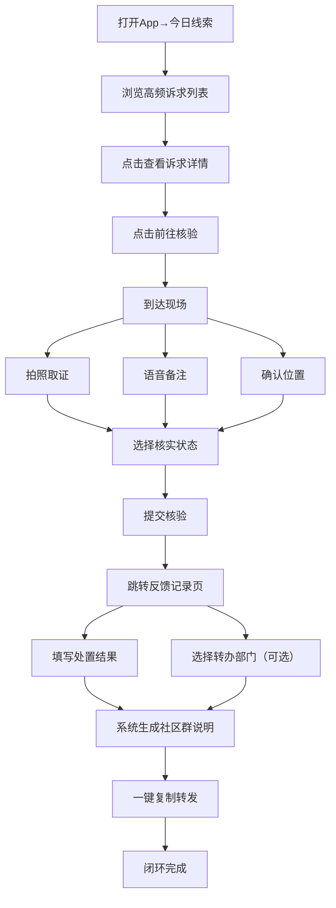

## 1. 产品概述

网格员线索闭环 App 是面向街道网格员的移动端轻量工具，用于监测和闭环处理辖区居民在线上渠道（微信群、社区公告评论、短视频同城区）反映的生活不便问题。产品仅设三个核心页面，帮助基层人员将线上舆情与线下走访打通，实现"发现—核验—反馈"全流程闭环。

- 目标用户：街道/社区网格员，日常负责巡查走访、民情收集和诉求处置
- 核心价值：将分散在线上各渠道的居民诉求聚合并排序，让网格员每天打开就能看到最需要关注的问题，并在现场完成核验、回传结果，系统自动生成可转发至社区群的简短说明

## 2. 核心功能

### 2.1 用户角色

| 角色 | 注册方式 | 核心权限 |
|------|----------|----------|
| 网格员 | 管理员分配账号 | 浏览线索、现场核验、填写反馈记录 |

### 2.2 功能模块

1. **今日线索页**：高频诉求列表、按小区分组排序、诉求详情（原始表述、相似人数、最近出现时间、来源渠道标签）、快速筛选
2. **现场核验页**：拍照取证、语音备注、位置确认、核实状态选择（属实/部分属实/待进一步了解）
3. **反馈记录页**：处置结果填写、转办原因选择、系统自动生成社区群简短说明、历史记录查看

### 2.3 页面详情

| 页面名称 | 模块名称 | 功能描述 |
|----------|----------|----------|
| 今日线索 | 小区分组卡片 | 按小区名称分组展示，每组显示小区名和今日线索数 |
| 今日线索 | 诉求条目 | 展示诉求原始表述（截断）、相似人数、最近出现时间、来源渠道标签（微信群/公告评论/短视频）、诉求类别图标 |
| 今日线索 | 诉求详情弹窗 | 点击诉求条目展开完整原始表述、所有相似表述列表、来源截图占位、快捷"前往核验"按钮 |
| 今日线索 | 顶部筛选栏 | 按诉求类别（垃圾清运、楼道照明、噪声扰民等）和来源渠道筛选 |
| 现场核验 | 关联线索信息 | 显示待核验诉求的摘要信息、小区定位 |
| 现场核验 | 拍照取证 | 调用相机拍照，最多3张，支持预览和删除 |
| 现场核验 | 语音备注 | 长按录音，松手结束，支持回放 |
| 现场核验 | 位置确认 | 自动获取当前GPS定位，显示地址文本，支持手动修正 |
| 现场核验 | 核实状态 | 三选一：属实、部分属实、待进一步了解 |
| 现场核验 | 提交核验 | 一键提交核验结果，自动跳转反馈记录页 |
| 反馈记录 | 待反馈列表 | 已核验但未填写处置结果的记录，按时间倒序 |
| 反馈记录 | 处置结果表单 | 文本输入处置结果、选择转办部门（可选）、转办原因（可选） |
| 反馈记录 | 社区群说明生成 | 根据核验和处置结果，系统自动生成一段适合转发至社区群的简短说明文案，支持一键复制 |
| 反馈记录 | 历史记录 | 已完成闭环的记录列表，按日期分组 |

## 3. 核心流程

网格员每日工作流程：

1. 打开 App，默认进入"今日线索"页，查看按小区排序的高频诉求
2. 点击某条诉求查看详情，了解居民原始表述和相似人数
3. 点击"前往核验"，进入"现场核验"页
4. 到达现场后，拍照、录音、确认位置，选择核实状态并提交
5. 提交后自动跳转"反馈记录"页，填写处置结果或转办信息
6. 系统自动生成社区群说明文案，网格员一键复制转发至社区群
7. 整个线索从发现到反馈实现闭环

## 4. 用户界面设计

### 4.1 设计风格

- **主色调**：深青色 (#0F766E) 作为品牌色，搭配暖橙色 (#F97316) 作为警示/强调色，背景使用浅灰 (#F8FAFC)
- **按钮风格**：圆角胶囊按钮，主操作使用实心填充，次操作使用描边样式
- **字体**：标题使用 Noto Sans SC Medium，正文使用 Noto Sans SC Regular，数字使用 DIN Alternate
- **布局风格**：移动端卡片式布局，底部 Tab 导航，顶部状态栏
- **图标风格**：使用 Lucide 线性图标，保持统一的线条粗细
- **整体风格**：政务工具感 + 现代简洁，注重信息密度和可读性，适合户外强光下使用

### 4.2 页面设计概览

| 页面名称 | 模块名称 | UI 元素 |
|----------|----------|---------|
| 今日线索 | 顶部栏 | 深青色背景，白色日期文字，右侧筛选图标 |
| 今日线索 | 小区分组卡片 | 白色圆角卡片，左侧小区名+线索数角标，右侧箭头 |
| 今日线索 | 诉求条目 | 白色条目，左侧类别图标，中间原始表述+来源标签，右侧相似人数+时间 |
| 今日线索 | 诉求详情弹窗 | 底部上滑弹窗，完整表述、相似表述列表、来源标签、"前往核验"按钮 |
| 现场核验 | 关联线索信息 | 顶部黄色提示卡片，显示诉求摘要 |
| 现场核验 | 拍照区域 | 3个图片占位框，点击调起相机 |
| 现场核验 | 语音按钮 | 圆形麦克风按钮，长按录音时脉冲动画 |
| 现场核验 | 位置信息 | 定位图标+地址文本，绿色确认标记 |
| 现场核验 | 核实状态 | 三个圆形选择按钮：属实（绿）、部分属实（黄）、待了解（灰） |
| 反馈记录 | 待反馈列表 | 左侧核验状态色条，中间诉求摘要+核验时间，右侧箭头 |
| 反馈记录 | 处置表单 | 多行文本输入框、下拉选择器 |
| 反馈记录 | 生成说明卡片 | 浅青色背景卡片，文案内容，右侧复制按钮 |

### 4.3 响应式设计

- 采用移动优先设计，目标屏幕宽度 375px - 428px
- 所有触控目标最小 44px × 44px
- 关键操作按钮固定在底部安全区域
- 支持横屏查看图片和地图
- 字体使用相对单位，适配不同屏幕密度

### 4.4 无障碍

- 所有交互元素具备足够的对比度（WCAG AA 标准）
- 图标均附带文字标签
- 表单输入提供清晰的错误提示
- 支持系统级字体缩放
