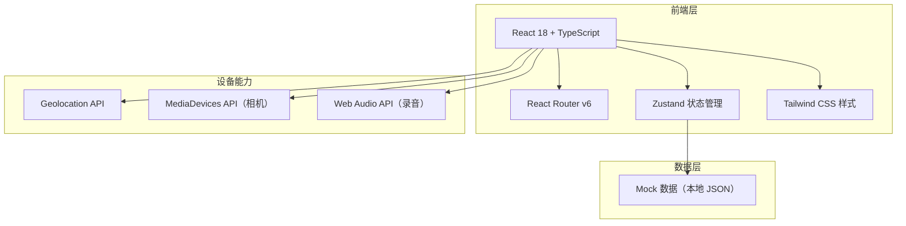
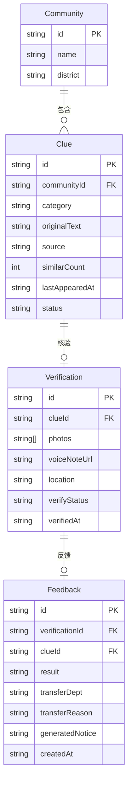

## 1. 架构设计

本项目为纯前端应用，使用 Mock 数据模拟后端接口，所有数据存储在 Zustand store 中。设备能力（定位、相机、录音）通过浏览器原生 API 调用，在桌面端提供模拟回退。

## 2. 技术说明

- **前端框架**：React 18 + TypeScript
- **构建工具**：Vite
- **样式方案**：Tailwind CSS 3
- **路由**：React Router DOM v6
- **状态管理**：Zustand
- **图标库**：lucide-react
- **后端服务**：无，使用 Mock 数据
- **数据库**：无，数据存储在 Zustand store 内存中

## 3. 路由定义

| 路由 | 用途 |
|------|------|
| / | 今日线索页 - 展示按小区分组的高频诉求列表 |
| /verify | 现场核验页 - 拍照、语音、位置、核实状态 |
| /verify/:id | 现场核验页（关联特定线索） |
| /feedback | 反馈记录页 - 处置结果、转办、生成说明 |

## 4. 数据模型

### 4.1 数据模型定义

### 4.2 数据定义

**Community（小区）**
| 字段 | 类型 | 说明 |
|------|------|------|
| id | string | 唯一标识 |
| name | string | 小区名称 |
| district | string | 所属片区 |

**Clue（线索）**
| 字段 | 类型 | 说明 |
|------|------|------|
| id | string | 唯一标识 |
| communityId | string | 关联小区ID |
| category | string | 诉求类别：garbage/lighting/noise/parking/water/other |
| originalText | string | 居民原始表述 |
| source | string | 来源渠道：wechat/bulletin/video |
| similarCount | number | 相似人数 |
| lastAppearedAt | string | 最近出现时间 ISO |
| status | string | 状态：pending/verifying/verified/feedback_done |

**Verification（核验）**
| 字段 | 类型 | 说明 |
|------|------|------|
| id | string | 唯一标识 |
| clueId | string | 关联线索ID |
| photos | string[] | 照片URL列表 |
| voiceNoteUrl | string | 语音备注URL |
| location | string | 核验位置地址 |
| verifyStatus | string | 核实状态：confirmed/partial/pending_further |
| verifiedAt | string | 核验时间 ISO |

**Feedback（反馈）**
| 字段 | 类型 | 说明 |
|------|------|------|
| id | string | 唯一标识 |
| verificationId | string | 关联核验ID |
| clueId | string | 关联线索ID |
| result | string | 处置结果文本 |
| transferDept | string | 转办部门 |
| transferReason | string | 转办原因 |
| generatedNotice | string | 系统生成的社区群说明 |
| createdAt | string | 创建时间 ISO |
